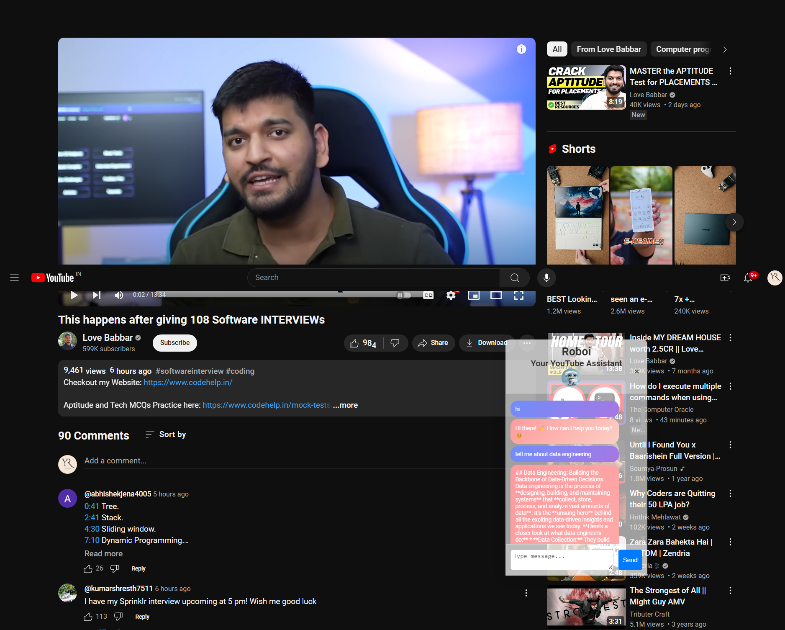
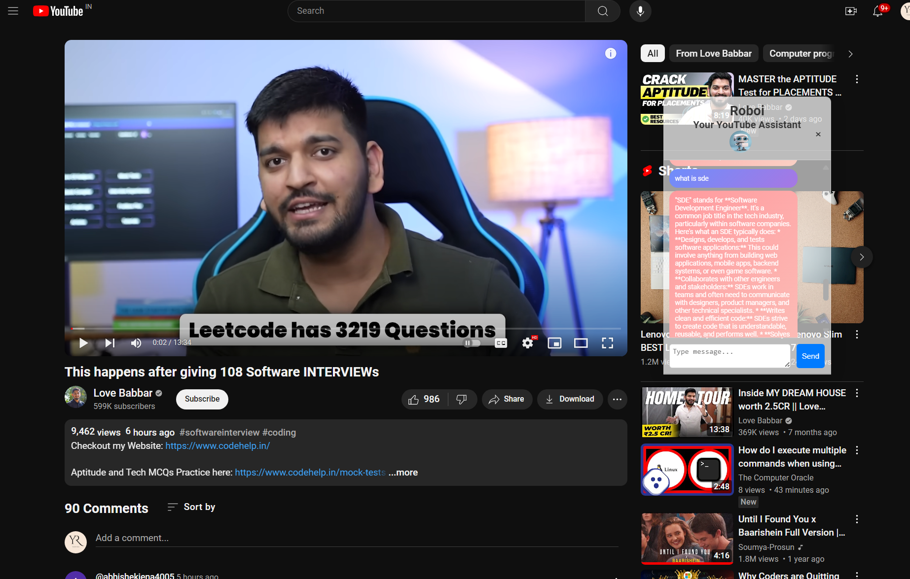

# YouTube Assistant Chrome Extension

## Description
YouTube Assistant is a Chrome extension that provides an interactive chat interface to assist users while watching YouTube videos. It integrates with the Gemini AI API to generate responses based on user queries.

## Features
- Chat interface embedded directly on YouTube video pages.
- Uses Gemini AI for generating responses to user queries.
- Allows users to interact by typing messages and receiving AI-generated responses.
- Simple and intuitive user interface.

## Installation
To use this extension, follow these steps:
1. Clone this repository or download the ZIP file and extract it.
2. Open Google Chrome.
3. Navigate to `chrome://extensions/` (or go to Chrome menu > More Tools > Extensions).
4. Enable **Developer mode** by toggling the switch in the upper-right corner.
5. Click on **Load unpacked** and select the directory where you cloned/downloaded the extension.

## Configuration
Before using the extension, you need to replace the placeholder API key in `background.js` with your actual Gemini API key. Here’s how:
1. Sign up for the Gemini AI API and obtain your API key.
2. Open `background.js` in a text editor.
3. Replace `'YOUR_API_KEY_HERE'` with your Gemini API key.

## Usage
Once installed and configured:
- Open any YouTube video in your Chrome browser.
- The YouTube Assistant chat interface will appear in the bottom right corner of the screen.
- Type a message in the input field and press **Send**.
- The extension will use the Gemini AI API to generate a response based on your query.
- Responses will be displayed in the chat interface in real-time.

## Screenshots

